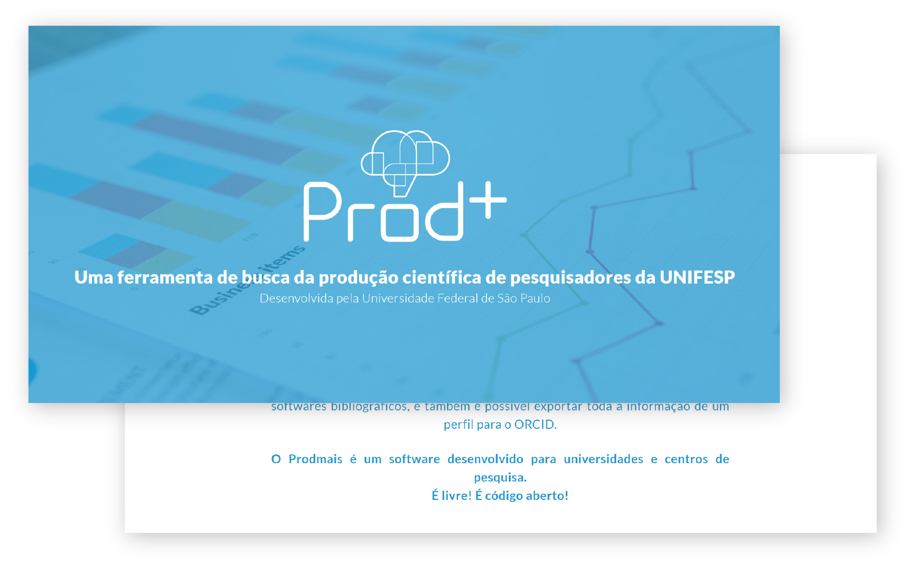

# Página promocional do Prodmais

  

Criada para servir de página promocional do [Prodmais](https://unifesp.br/prodmais/). Você pode conferir ela clicando [aqui](https://unifesp.br/prodmais/promo/).

Visite meu reposítório [identidade visual do Prodmais](https://github.com/RicardoIreno/ricardoireno/blob/main/prodmais.md)

### Cria usando o framwork [Jekyll](https://jekyllrb.com).

Para rodar, após instalado o Jakyll, rode o comando `jekyll s`.
